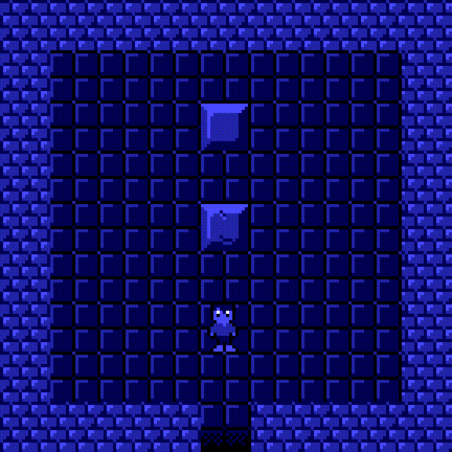

# Block Push

Originally started as my entry for the 2018 LISP Game Jam, now I use this to tinker with LISP.



The above level might be too easy ;) 

# Install

**Depends**
- [sbcl](http://www.sbcl.org/)
- [trivial-gamekit](https://github.com/borodust/trivial-gamekit)

1. Install dependencies
```sudo apt-get install sbcl```

2. Clone the repository
```git clone https://github.com/manila/block-push```

3. Enter ```sbcl``` and load block-push.lisp ```(load "cloned_repo_dir/block-push.lisp")```


# Objective

Escape the room by pushing blocks around the room to make a path to the exit.

# How to Play

WASD keys for moving around the map

You can only push one block at a time so you will need to use some strategy to escape

# TODO

- Save game state
- Main Menu
- Help Menu
- Map editor
- Challenging levels
- Scoring

